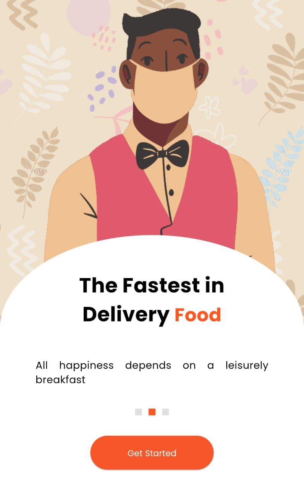
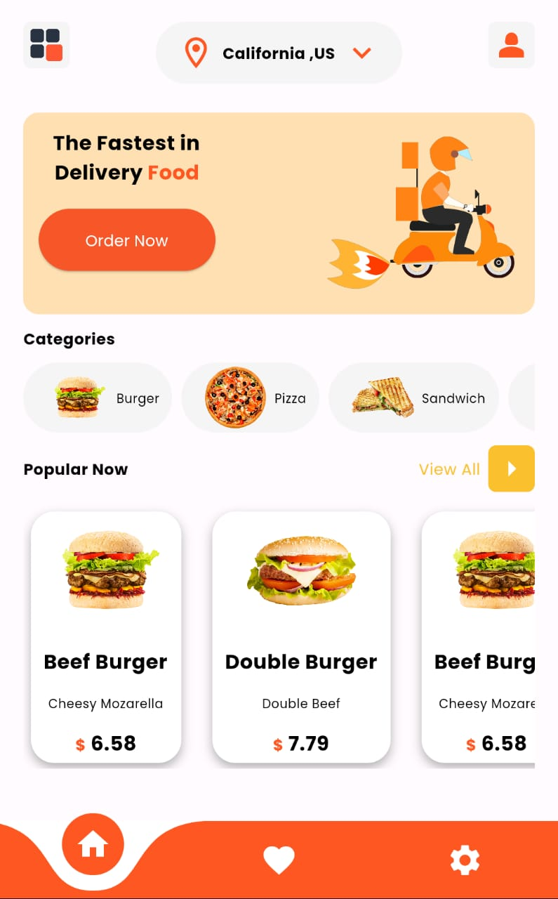
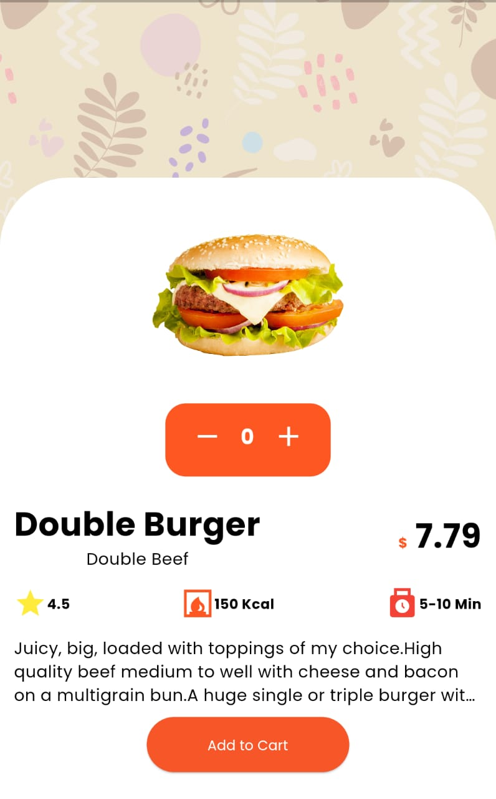

# Food Delivery App UI

 

Welcome to the Flutter Weather App project! This project aims to create a visually appealing and user-friendly UI for a food delivery app. The app will provide an intuitive and delightful user experience, making it easy for users to browse restaurants and select dishes.
- **UI Design**: Follow Material Design guidelines or your brand's design principles for a visually pleasing and consistent user interface.

- **User Experience**: Prioritize a smooth and intuitive user journey, making it easy for users to browse, order, and track their deliveries.

- **Performance**: Optimize the app's performance by minimizing unnecessary animations and network requests.
- **Themes**: Create a custom theme using Flutter's Theme widget to set colors, fonts, and styles that match your brand.

- **Widgets**: Utilize Flutter's extensive library of widgets to create a visually appealing and user-friendly interface. Customize widgets like ListView, Card, Button, and TextField to fit your design.

# Screenshots

  &nbsp;
 
 
